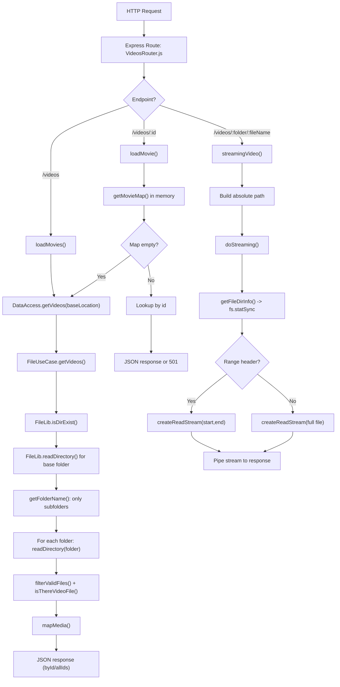
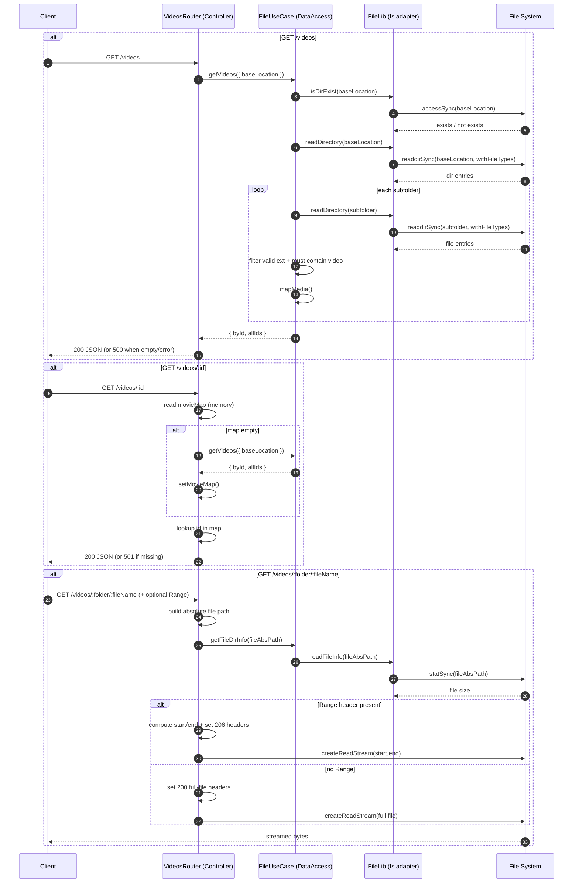

# Videos Router Flow (Controller to File System)

```mermaid
flowchart TD
  A["HTTP Request"] --> B["Express Route: VideosRouter.js"]
  B --> C{"Endpoint?"}

  C -->|"/videos"| D["loadMovies()"]
  D --> E["DataAccess.getVideos(baseLocation)"]
  E --> F["FileUseCase.getVideos()"]
  F --> G["FileLib.isDirExist()"]
  G --> H["FileLib.readDirectory() for base folder"]
  H --> I["getFolderName(): only subfolders"]
  I --> J["For each folder: readDirectory(folder)"]
  J --> K["filterValidFiles() + isThereVideoFile()"]
  K --> L["mapMedia()"]
  L --> M["JSON response (byId/allIds)"]

  C -->|"/videos/:id"| N["loadMovie()"]
  N --> O["getMovieMap() in memory"]
  O --> P{"Map empty?"}
  P -->|Yes| E
  P -->|No| Q["Lookup by id"]
  Q --> R["JSON response or 501"]

  C -->|"/videos/:folder/:fileName"| S["streamingVideo()"]
  S --> T["Build absolute path"]
  T --> U["doStreaming()"]
  U --> V["getFileDirInfo() -> fs.statSync"]
  V --> W{"Range header?"}
  W -->|Yes| X["createReadStream(start,end)"]
  W -->|No| Y["createReadStream(full file)"]
  X --> Z["Pipe stream to response"]
  Y --> Z
```

## Sequence Diagram (Request/Response Timeline)

```mermaid
sequenceDiagram
  autonumber
  participant Client
  participant Router as VideosRouter (Controller)
  participant UseCase as FileUseCase (DataAccess)
  participant FileLib as FileLib (fs adapter)
  participant FS as File System

  alt GET /videos
    Client->>Router: GET /videos
    Router->>UseCase: getVideos({ baseLocation })
    UseCase->>FileLib: isDirExist(baseLocation)
    FileLib->>FS: accessSync(baseLocation)
    FS-->>FileLib: exists / not exists
    UseCase->>FileLib: readDirectory(baseLocation)
    FileLib->>FS: readdirSync(baseLocation, withFileTypes)
    FS-->>FileLib: dir entries
    loop each subfolder
      UseCase->>FileLib: readDirectory(subfolder)
      FileLib->>FS: readdirSync(subfolder, withFileTypes)
      FS-->>FileLib: file entries
      UseCase->>UseCase: filter valid ext + must contain video
      UseCase->>UseCase: mapMedia()
    end
    UseCase-->>Router: { byId, allIds }
    Router-->>Client: 200 JSON (or 500 when empty/error)
  end

  alt GET /videos/:id
    Client->>Router: GET /videos/:id
    Router->>Router: read movieMap (memory)
    alt map empty
      Router->>UseCase: getVideos({ baseLocation })
      UseCase-->>Router: { byId, allIds }
      Router->>Router: setMovieMap()
    end
    Router->>Router: lookup id in map
    Router-->>Client: 200 JSON (or 501 if missing)
  end

  alt GET /videos/:folder/:fileName
    Client->>Router: GET /videos/:folder/:fileName (+ optional Range)
    Router->>Router: build absolute file path
    Router->>UseCase: getFileDirInfo(fileAbsPath)
    UseCase->>FileLib: readFileInfo(fileAbsPath)
    FileLib->>FS: statSync(fileAbsPath)
    FS-->>FileLib: file size
    alt Range header present
      Router->>Router: compute start/end + set 206 headers
      Router->>FS: createReadStream(start,end)
    else no Range
      Router->>Router: set 200 full-file headers
      Router->>FS: createReadStream(full file)
    end
    FS-->>Client: streamed bytes
  end
```
