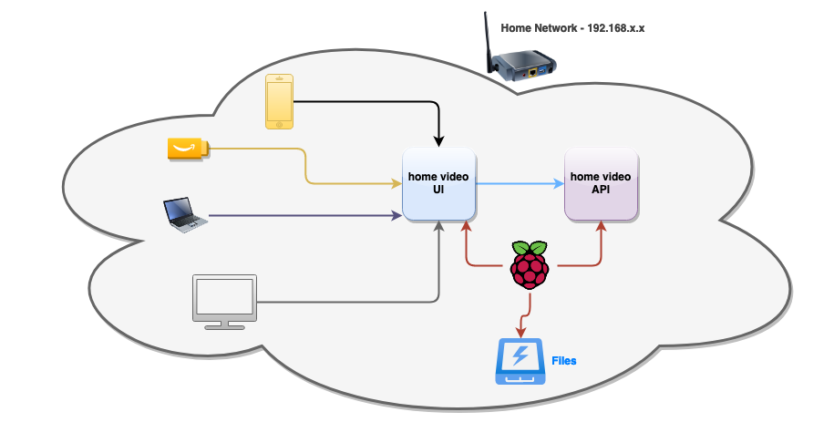
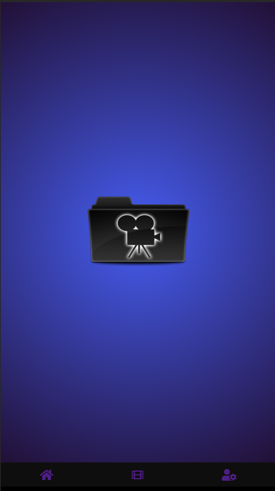
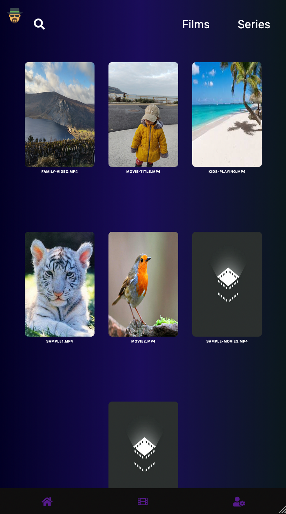
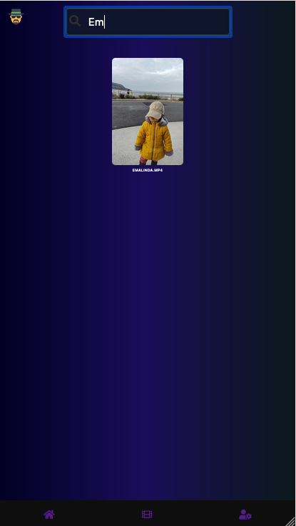
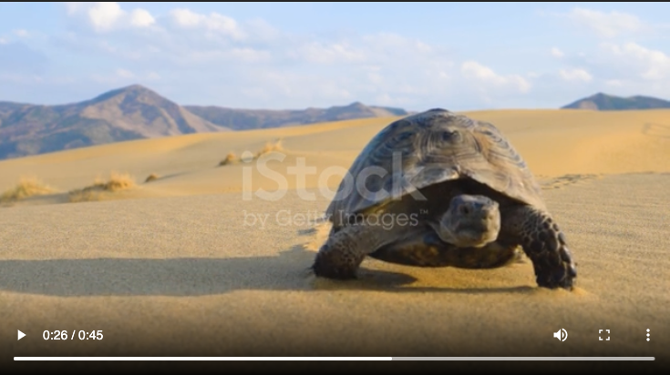
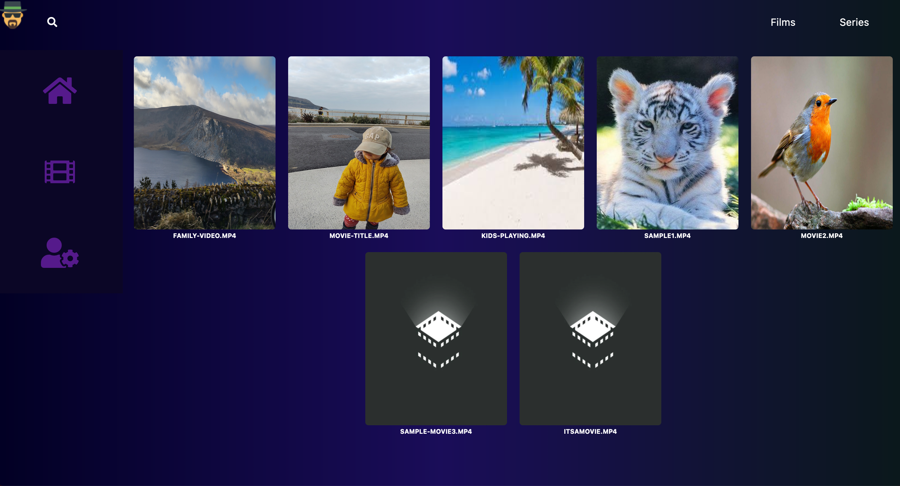
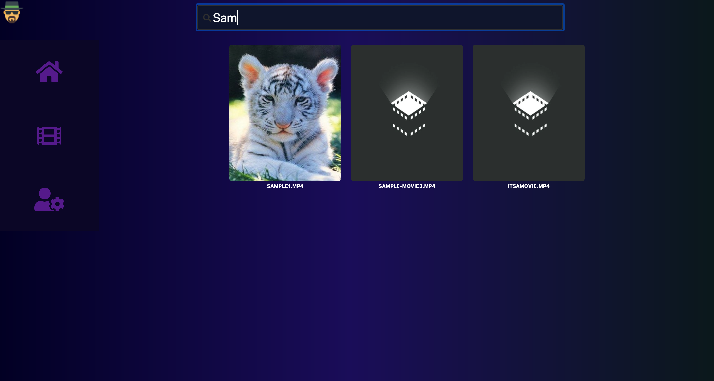

# Home Video Documentation

This directory is the canonical documentation for the monorepo.

## Overview

Home Video is a hobby/learning project focused on:

- Node.js backend media discovery and streaming
- React SPA playback and browsing UI
- simple local-network deployment (desktop or Raspberry Pi)
- iterative improvements with clear, stable docs

## Docs Index

- [Local development](setup/local-dev.md)
- [Raspberry Pi deployment](deploy/raspberry-pi.md)
- [Raspberry Pi one-click bootstrap](deploy/pi-one-click-bootstrap.md)
- [Google Drive with `rclone`](storage/google-drive-rclone.md)
- [Backend media scanning](backend/media-scanning.md)
- [Authentication](auth/authentication.md)
- [Common issues](troubleshooting/common-issues.md)

## Visual Assets

- App logo: `assets/logo.png`
- Main design image: `assets/design.png`
- Media folder structure image: `assets/files-structure.png`
- Additional folder reference image: `assets/folder.png`

### App Logo

### Design

### Mobile Screens

### Player

### Desktop Screens

## Diagram Sources

Draw.io source files migrated from legacy docs:

- `draw.io/Design.drawio`
- `draw.io/Untitled Diagram.drawio`

## Migration Notes

This project was previously split into separate repositories (`web`, `api`, and `docs`).

Migration policy:

- monorepo docs are source of truth for current setup
- old polyrepo references are treated as legacy
- when conflict exists, keep monorepo behavior

Legacy repo:

- [home-video-docs](https://github.com/eliasjunior/home-video-docs)
