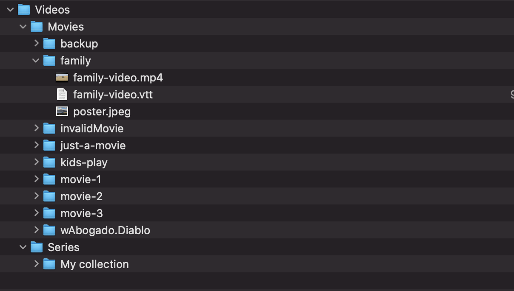

# Backend Media Scanning

[Back to root README](../../README.md)


## Supported Layouts

Movie scanner supports both:

```text
<VIDEO_PATH>/Movies/<MovieFolder>/<videoFile>
<VIDEO_PATH>/Movies/<videoFile>
```

Series scanner expects series folders under `<VIDEO_PATH>/Series`.

Reference diagram:



## Source Profile Resolution

The API supports profile-based paths:

```env
VIDEO_SOURCE_PROFILE=local # or gdrive
VIDEO_PATH_LOCAL=/path/to/local/videos
VIDEO_PATH_GDRIVE=/path/to/google-drive-mounted/videos
```

`VIDEO_PATH` is still accepted for compatibility.

## Flat Layout Collision Guard

When using flat movie files, IDs can collide if two files share the same basename.

Expected behavior for the collision guard:

- detect duplicate derived IDs during scan
- avoid returning ambiguous entries with same ID
- fail clearly or skip with explicit warning (implementation-defined, but deterministic)
- document final behavior in API changelog/PR once guard is merged

## Images and Subtitles

Media organization remains file-system based (movies, series, images, subtitles). Keep related assets close to media files where possible.
